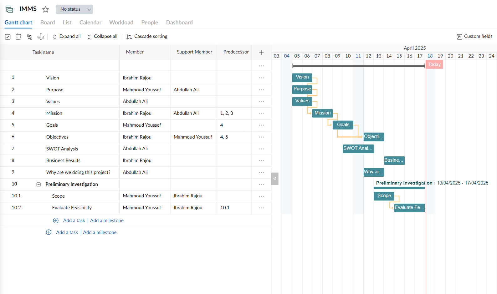
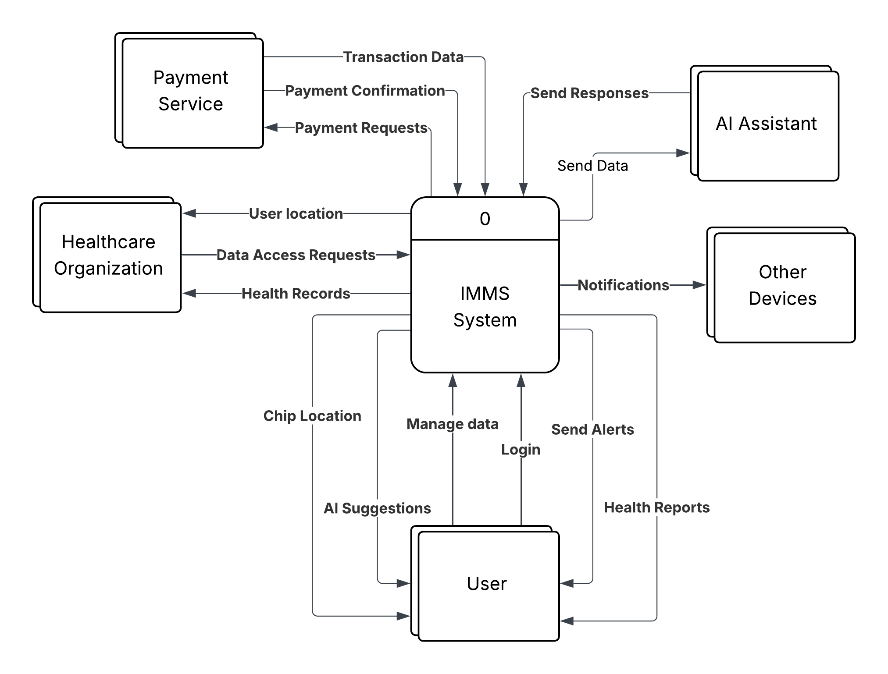

  
  &nbsp;&nbsp;&nbsp;
  
  &nbsp;&nbsp;&nbsp;
  

# IMMS - Implanted Microchips Management System

## Project Overview
The project documents the **Planning, Analysis, and Design** phases of the Software Development Life Cycle (SDLC) for the Implanted Microchips Management System (IMMS). It demonstrates the process from defining the project's vision and feasibility to eliciting system requirements, modeling business processes, and designing a mobile application prototype.

## Key Features 
- Secure microchip registration
- Medical data management
- Vital signs monitoring 
- Real-time location tracking
- Emergency alerts
- Multi-microchip support
- Medication reminders
- AI assistant

## SDLC Phases
<table>
  <thead>
    <tr>
      <th>Phase</th>
      <th>Deliverables</th>
    </tr>
  </thead>
  <tbody>
    <tr>
      <td>Planning</td>
      <td>Vision, Mission, SWOT, MoSCoW, Feasibility Study, Gantt Chart</td>
    </tr>
    <tr>
      <td>Analysis</td>
      <td>Functional Requirements, Non-functional Requirements, Questionnaire, DFDs</td>
    </tr>
    <tr>
      <td>Design</td>
      <td>Mobile UI/UX designed in Figma</td>
    </tr>
  </tbody>
</table>

## Planning Phase
The planning phase established the project's vision, mission, goals, and scope. It also assessed the project's feasibility by conducting technical, operational, economic, and scheduling feasibility studies, ensuring that the system was viable before development.

**Gantt Chart**

**Full documentation:** [Planning.pdf](docs/1-IMMS_Planning.pdf)

## Analysis Phase
The analysis phase focused on understanding user needs and eliciting both function and non-functional requirements through user questionnaire and research.

**Data Flow Diagram (Context Diagram)**

**Full documentation:** [Analysis.pdf](docs/2-IMMS_Analysis.pdf)

## Design Phase
The design phase focused on creating a user-friendly mobile application interface using **Figma**. The prototype includes the application's Login, Dashboard, Sidebar Menu, and AI Assistant screens.

**Prototype Screens:**
- [Login Screen](images/2_login.jpg)
- [Dashboard Screen](images/3_dashboard.jpg)
- [Sidebar Menu Screen](images/4_sidebar-menu.jpg)
- [AI Assistant Screen](images/5_ai-assistant.jpg)

**Figma Prototype Demo** 

**Full documentation:** [Design.pdf](docs/3-IMMS_Design.pdf)

## Tools used
- GanttPRO
- Lucidchart
- Figma
- Google Forms
- Microsoft Word

## Authors
- [Ibrahim Rajou](https://github.com/IbrahimRajou)
- [Mahmoud Youssef](https://github.com/MahmoudYoussuf)
- Abdullah Ali
